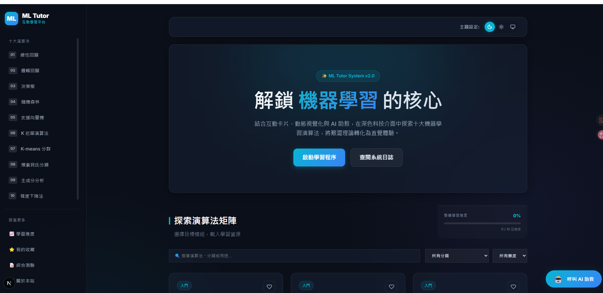

# ML Algorithm Tutor 機器學習前十大演算法互動學習網站

## 1. 專案介紹
這是一個適合新手小白學習機器學習的互動式網站。專案將原本靜態的「機器學習前十大演算法」轉換成一個可互動、可學習、可問答的動態網頁。透過白話解釋、生活化比喻、圖解動畫及 AI 虛擬助教，幫助沒有資訊背景的人也能輕鬆理解機器學習的核心概念。

## 2. 技術棧
**前端：**
- Next.js (App Router)
- React
- TypeScript
- Tailwind CSS
- Zustand (狀態管理)
- Framer-motion (動畫與轉場)

**後端：**
- FastAPI
- Python

## 3. 功能列表
- **首頁互動總覽：** 十大演算法主題卡片、任務類型分類及推薦學習路線。
- **演算法詳細學習頁：** 包含白話解釋、生活比喻、運作流程、實務應用及優缺點。
- **圖解動畫區：** 根據不同演算法的專屬視覺化呈現。
- **主題式小測驗：** 每個主題皆有測驗檢驗學習成果。
- **學習進度紀錄：** 透過 localStorage 或資料庫紀錄學習狀態及分數。
- **收藏與搜尋功能：** 方便尋找與標記喜愛的演算法主題。
- **AI 助理問答區與虛擬助教：** 針對每個演算法提問，AI 會以白話回答，並以 Live2D (或 fallback 角色卡片) 形式呈現對話。

## 4. 專案結構
本專案為前後端分離架構：
```text
hw5/
  ├── backend/    # FastAPI API 伺服器
  └── frontend/   # Next.js App Router 網頁前端
```

## 5. 前端啟動方式
請先確認已安裝 Node.js，然後執行以下指令啟動前端服務：
```powershell
cd D:\SeanLin\Python\hw5\frontend
# 如果是第一次執行，請先安裝相依套件：npm install
$env:NEXT_PUBLIC_BACKEND_URL="http://127.0.0.1:8010"
npm run dev -- -p 4000
```
網站預設會運行於：
```text
http://localhost:4000 (或 http://localhost:3000)
```

## 6. 後端啟動方式
請確保已安裝 Python 及相關依賴（可透過 `pip install -r requirements.txt` 安裝），並執行：
```powershell
cd D:\SeanLin\Python\hw5\backend
..\..\.venv\Scripts\python.exe -m uvicorn main:app --reload --port 8010
```
後端 API 與文件連結：
- 首頁：`http://127.0.0.1:8010`
- API 測試文件：`http://127.0.0.1:8010/docs`

## 7. 環境變數設定
**前端 `.env.local`** (位於 frontend 資料夾下)：
```env
NEXT_PUBLIC_API_BASE_URL=http://127.0.0.1:8010
NEXT_PUBLIC_APP_NAME=ML Algorithm Tutor
```

**後端 `.env`** (位於 backend 資料夾下)：
```env
APP_NAME=ML Algorithm Tutor API
ENV=development
CORS_ORIGINS=http://localhost:4000,http://localhost:3000
LLM_PROVIDER=openai
OPENAI_API_KEY=your_api_key_here
MODEL_NAME=gpt-4o-mini
DATABASE_URL=sqlite:///./ml_tutor.db
```

## 8. AI API Key 設定
若要啟用 AI 助教，需要在啟動後端前設定 `OPENAI_API_KEY`，例如在 PowerShell 終端機中設定：
```powershell
$env:OPENAI_API_KEY="your_api_key_here"
```
*備註：如果沒有設定 API Key，AI 問答可提供 mock 模式以供開發者測試 UI。*

## 9. 開發階段說明
本專案開發分為以下階段：
1. **Phase 1：靜態學習網站** - Next.js 專案建立、首頁、十大演算法卡片及 RWD。
2. **Phase 2：FastAPI 後端** - 演算法 API、測驗 API、搜尋 API 與 CORS 設定。
3. **Phase 3：互動學習功能** - 小測驗、收藏及學習進度 (localStorage/SQLite)。
4. **Phase 4：AI 助理** - 聊天 UI、FastAPI `/api/chat`、Prompt 設計與 LLM API 串接。
6. **Phase 5：視覺優化** - 演算法圖解動畫、元件轉場特效及全站錯誤處理。

## 10. 常見問題
**Q: 如果遇到「小璃老師暫時連不上」怎麼辦？**
A: 請確認後端 FastAPI 伺服器已正常啟動，且前端的環境變數 `NEXT_PUBLIC_BACKEND_URL` 或 `NEXT_PUBLIC_API_BASE_URL` 正確指向後端服務的位址，並檢查 OpenAI API Key 是否正確。

**Q: 找不到演算法主題或測驗資料？**
A: 請確保後端資料庫 (`ml_tutor.db`) 已建立，或內建的 JSON 資料 (`algorithms.json`) 正確配置於後端目錄中。

## 11. 未來擴充方向
- **擴充登入系統：** 將學習進度從 localStorage 移至雲端儲存，支援跨裝置學習。
- **增強 Live2D 互動：** 加入更多表情與語音支援，讓學習體驗更有趣。
- **新增進階內容：** 增加深度學習、強化學習等演算法主題。
- **社群與排行榜：** 新增學習排行榜與心得分享功能。
