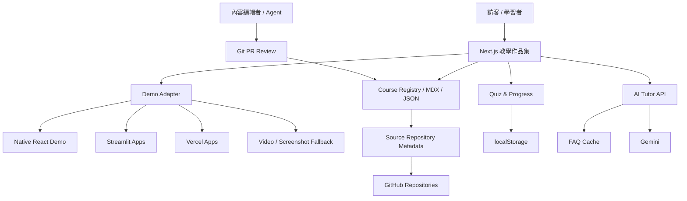
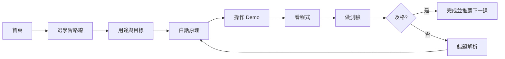

# AI Learning Portfolio｜AI 學習作品集與教學網站 - 開發規格書

## 中文重點摘要

- 將分散在多個 GitHub Repository 的課程作業整合為「個人作品集＋新手教學網站」。
- 採「中央入口整合、原專案保留」策略：先建立統一教材、Demo 入口、技術解析、測驗與學習路線，後續再逐一內嵌成熟模組。
- 以本 Repository 作為技術母體，沿用 Next.js、教學內容、測驗、進度與 AI 助教能力。
- 每份作業統一改寫為六段式教學：**用途 → 白話原理 → 操作 Demo → 程式解析 → 小測驗 → 延伸挑戰**。
- 原作業 Repository 保留，作為版本歷史、原始碼證據與獨立部署來源。

## 0. 文件資訊

- 文件版本：v1.0
- 產生日期：2026-07-15
- 專案定位：AI、機器學習、資料與 Web 課程作品集平台
- 建議版本：進階版
- 適用工具：Gemini / Codex / Antigravity / OpenCode
- 開發分支：`feat/ai-learning-portfolio-platform`

## 1. 專案分類

- 主分類：`21 教育學習平台`
- 主大類別：`G08 平台服務類`
- 次分類：`09`、`13`、`16`、`18`、`19`、`24`
- 複雜度：高
- 建議版本：進階版
- Workflow Key：`21-ai-learning-portfolio-v1.0-C8A7F1`
- Skill Key：`SK21-C8A7`
- Employee Key：`EP21-C8A7`

## 2. 專案摘要

### 一句話說明

把散落的課程作業變成一座新手也看得懂、能親手操作、能追蹤學習成果的 AI 與資料科學作品博物館。

### 目標使用者

- AI、Python、機器學習與 Web 開發新手
- 課程老師、同學與評審
- 面試官、合作夥伴與潛在客戶
- 未來接手維護的開發者與 AI Agent

### 核心價值

- 看得懂：白話、生活比喻、圖解
- 玩得到：可操作 Demo 或模擬器
- 查得到：可依技術、難度、主題搜尋
- 學得會：學習目標、步驟、測驗、延伸挑戰
- 驗得出：保留 Repository、Demo、測試與版本證據

## 3. 產銷人發財

- **產**：將作業轉成標準教材資料與共用頁面元件。
- **銷**：作為 GitHub、履歷、比賽、面試與提案的主入口。
- **人**：訪客、學習者、內容編輯者、管理者與 AI Agent。
- **發**：先建立 Registry，再逐一整合 Demo 與課程。
- **財**：初期以作品集與教學品牌為主，後續可延伸顧問、內訓與付費課程。

## 4. 需求範圍

### 4.1 MVP

- 首頁、個人介紹、課程目錄
- 至少 8 個作業完成教學化
- 六段式課程模板
- Demo、GitHub、截圖入口
- 搜尋、收藏、localStorage 進度
- 每課 3～5 題測驗
- RWD、SEO、錯誤處理

### 4.2 進階版（本次目標）

- 全部已確認課程作業納入目錄
- Python、資料取得、ML、視覺化、Web、AI 學習路線
- 統一 Demo Adapter
- 測驗、學習進度、內容版本
- AI 助教與無 API Key 降級模式
- Git-based CMS、內容 Schema 與 CI 驗證

### 4.3 商用版

- 會員與跨裝置進度
- CMS / 管理後台
- RAG 知識庫與引用
- 多語言、付費課程、證書、金流
- 教師 / 學員 / 管理員權限與多租戶

### 4.4 不包含

- 不刪除原始 Repository
- 不一次搬移所有 Git 歷史
- 不在 Vercel 執行長時間模型訓練或 Manim 渲染
- 不公開 API Key、私有原始碼或敏感資料

## 5. 角色與權限

| 角色 | 權限 |
|---|---|
| 訪客 | 瀏覽公開課程、作品與 Demo |
| 學習者 | 收藏、記錄本機進度、作答、使用 AI 助教 |
| 內容編輯者 | 維護 MDX / JSON、圖片與測驗 |
| 管理者 | 管理發布狀態、版本與外部連結 |
| AI Agent | 依 AGENT.md 開發、測試、更新紀錄 |

第一階段內容發布採 Git PR 審核，不建立後台登入。

## 6. 核心功能模組

### 6.1 首頁

目的：30 秒內理解作者、技術能力與推薦學習路線。

驗收：手機無水平捲動、可進入至少三條學習路線、精選作品可操作。

### 6.2 課程目錄

功能：關鍵字、技術、難度、作業編號、Demo 狀態與學習路線篩選。

驗收：篩選可透過 URL Query 重現；無結果有重設功能。

### 6.3 六段式教學頁

固定內容：

1. 這個主題能做什麼
2. 白話原理與生活比喻
3. 操作 Demo
4. 程式架構與關鍵程式碼
5. 小測驗
6. 延伸挑戰與下一課

驗收：每課有目標、先備知識、時間、難度、圖解、Demo、原始碼與測驗。

### 6.4 Demo Adapter

支援：

- `native`
- `iframe`
- `external`
- `video`
- `snapshot`

每個 Demo 必須有 fallback；外部服務失效不得造成整頁白屏。

### 6.5 測驗與學習進度

- 單課測驗、綜合測驗、收藏與完成標記
- MVP 使用 localStorage
- 可清除學習紀錄

### 6.6 AI 助教

- 優先依據當前課程回答
- 先給結論，再用例子解釋
- 不知道時明確說明
- 無 API Key 時使用 FAQ / mock fallback
- 記錄 Prompt Version 與 Token 成本

## 7. 前台頁面

| 路由 | 頁面 |
|---|---|
| `/` | 首頁 |
| `/courses` | 課程目錄 |
| `/courses/[slug]` | 教學頁 |
| `/paths` | 學習路線 |
| `/paths/[slug]` | 路線詳情 |
| `/projects` | 作品集 |
| `/progress` | 學習進度 |
| `/favorites` | 收藏 |
| `/quiz` | 綜合測驗 |
| `/about` | 關於 |
| `/changelog` | 更新紀錄 |

## 8. 內容管理

採 Git-based CMS：

```text
content/
  courses/
    linear-regression/
      index.mdx
      metadata.json
      quiz.json
      assets/
  paths/
  registry.json
```

發布狀態：`draft`、`review`、`published`、`deprecated`。

AI 產生內容只能進入 draft，必須經 PR 審核。

## 9. AI 規格

System Prompt 核心：

1. 你是新手友善的繁體中文技術助教。
2. 優先使用目前課程內容。
3. 先給一句結論，再逐步解釋。
4. 不捏造函式、數據、來源。
5. 投資預測、敏感人口欄位需提示風險。
6. 低信心時建議查看原始碼或縮小問題。

成本控管：FAQ 快取、Context 限制、輸出長度限制、每日 Token 上限、失敗降級。

## 10. 第三方整合

- GitHub：來源 Repo、版本與連結
- Vercel：中央網站與部分 Demo
- Streamlit Cloud：既有 ML / AI Demo
- Gemini：AI 助教
- CWA OpenData：天氣案例
- OpenStreetMap / Leaflet：地圖案例

需處理 Rate Limit、冷啟動、iframe 限制、API Key、資料來源條款與 Attribution。

## 11. 系統架構



建議結構：

```text
app/{courses,paths,projects,progress,favorites,quiz,api}
components/{course,demo,quiz,learning-path,portfolio}
content/{courses,paths,registry.json}
lib/{content,demo-adapters,progress,github,ai}
docs/{specs,tasks,km,completed}
tests/
```

## 12. 資料設計

進階版以靜態內容＋localStorage 為主；商用版預留：

- `courses`
- `course_sections`
- `source_repositories`
- `demos`
- `quizzes`
- `quiz_questions`
- `users`
- `learning_progress`
- `ai_usage_logs`

核心欄位包含 slug、難度、預估時間、發布狀態、來源 Repo、Demo 模式、健康狀態、Prompt Version、Token 與成本。

## 13. API 草案

```http
GET /api/courses
GET /api/courses/{slug}
GET /api/paths
GET /api/paths/{slug}
GET /api/projects
GET /api/search?q=&tag=&difficulty=
GET /api/demos/{id}/health
POST /api/quiz/{courseId}/submit
POST /api/ai/chat
```

AI Response 需包含：`answer`、`confidence`、`citations`、`fallback`。

## 14. 主要流程



新增作業：Repo → Metadata → 六段式教材 → Demo Adapter → Quiz → CI → PR 審核 → 發布 → 更新 KM。

## 15. 非功能需求

- 靜態生成與圖片最佳化
- 外部 Demo 延遲載入
- Loading / Empty / Error / Offline 狀態
- WCAG AA 基本對比、鍵盤操作、reduced motion
- iframe allowlist 與 sandbox
- TypeScript strict、Zod Schema
- SEO Metadata、OG、Sitemap、Course 結構化資料

## 16. 報價與時程估算

平台服務綠地開發參考：

- MVP：NT$200,000～500,000
- 進階版：NT$500,000～1,200,000
- 商用版：NT$1,200,000～3,000,000+

重用既有成果後，本專案進階版估算：

- **NT$250,000～650,000**
- **8～16 週**

此為估算級距，不是正式報價。

## 17. 測試計畫

- 單元：Schema、搜尋、進度、計分、Demo 模式
- 整合：Registry → 列表 → 詳情、localStorage、AI 降級、Demo fallback
- E2E：選路線 → 完成課程 → 操作 Demo → 測驗 → 保留進度 → 下一課
- 內容：六段式、白話解釋、圖解、Repo、Demo、倫理聲明

CI：

```bash
npm run lint
npm run typecheck
npm run test
npm run build
npm run validate:content
npm run check:links
```

## 18. 驗收標準

- 至少 12 個作業 / 主題納入目錄
- 至少 8 個主題完成完整六段式教學
- 每課可追溯來源 Repository
- 每課有可用 Demo 或 fallback
- 搜尋、篩選、收藏、進度、測驗正常
- AI 無 Key 時能降級
- 手機、桌機、Build、基本無障礙通過
- README、AGENT.md、DEVELOPMENT_RECORD、KM 同步

## 19. 開發任務

### P0｜平台骨架

- `ALP-P0-001` Course / Project / Demo Schema
- `ALP-P0-002` 作業 Registry
- `ALP-P0-003` 品牌、導航與首頁 IA
- `ALP-P0-004` 六段式教學頁模板
- `ALP-P0-005` Demo Adapter 與 fallback

### P1｜學習體驗

- 課程搜尋與篩選
- 學習路線
- 收藏與進度
- 單課與綜合測驗

### P2｜首批 ML 教材

- L4 線性迴歸
- machinelearningHw05 十大演算法
- machinelearningHw6 CRISP-DM
- machinelearningHw6-2 新創利潤
- L13 SVM Kernel Trick
- hw07 特徵選擇

### P3｜資料、Web、AI

- cwa_scraper
- scrape_weather
- scrape_movie
- 2026-DjangoBlog
- hw3-cosmos-text2image
- L2DOC1-github

### P4～P6

- L12 Manim、L20 Ensemble
- AI 助教、Prompt Registry、Token Log
- SEO、Link Checker、E2E、部署、Repo 更名計畫

## 20. 給開發工具的實作提示語

你正在 `gshan1209-cell/machinelearningHw05` 的 `feat/ai-learning-portfolio-platform` 分支開發 AI Learning Portfolio。

開始前讀取：

1. `AGENT.md`
2. `DEVELOPMENT_RECORD.md`
3. 本規格書

規則：

- 保留既有十大演算法功能，不能 regression。
- 不刪除其他原始 Repository。
- 建立統一 Course Registry 與 Zod Schema。
- 新增課程不得修改核心頁面。
- 每課固定包含用途、原理、Demo、程式、測驗、挑戰。
- Demo 支援 native / iframe / external / video / snapshot，且有 fallback。
- 先完成 `ALP-P0-001`～`ALP-P0-005`，不要一次搬全部作業。
- AI 教材只能是 draft，需 PR 審核。
- 不提交 API Key、Token、密碼或私有內容。
- 完成後更新 DEVELOPMENT_RECORD、任務狀態與 KM 文件。

第一輪交付：

1. `content/registry.json` 與 Course Schema。
2. `/courses` 與 `/courses/[slug]`。
3. 六段式教學頁元件。
4. 三門示範課：線性迴歸、SVM Kernel Trick、CWA OpenData。
5. Demo Adapter 與 fallback。
6. 測試、型別檢查與 build 證據。

## 附錄｜來源 Repository

| Repository | 教學主題 |
|---|---|
| `L2DOC1-github` | AI Tools Lab、圖文故事播放器 |
| `hw3-cosmos-text2image` | 文字生成圖片、Prompt、API |
| `L4` | 線性迴歸與離群值 |
| `machinelearningHw05` | 十大機器學習演算法 |
| `machinelearningHw6` | CRISP-DM Regression |
| `machinelearningHw6-2` | 新創公司利潤預測 |
| `L12` | 台股 Manim 動畫 |
| `L13_SVM` | SVM Kernel Trick |
| `hw07` | Boston Housing 特徵選擇 |
| `cwa_scraper` | CWA OpenData CLI |
| `scrape_movie` | 電影爬蟲與 REST API |
| `scrape_weather` | 天氣與農事風險儀表板 |
| `2026-DjangoBlog` | Django 與 Admin |
| `L20-Ensemble-Model` | Ensemble 與收入分類 |